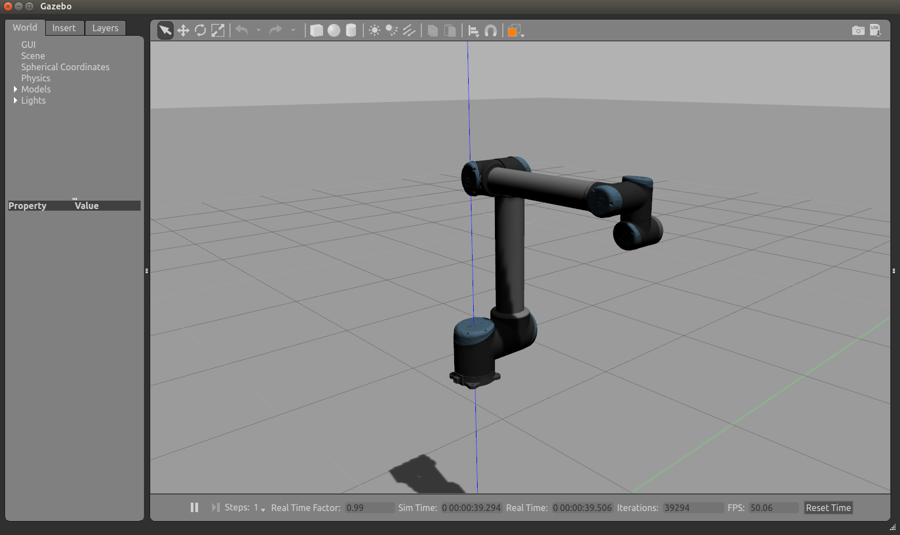

# robot-hardware-kinetic-level-v1.0

## Description:
This project realized the hardware interface of a real robot, which is based on ros-kinetic. And it can be used on gazebo simulation simultaneously. An UR10 robot in gazebo in used to confirm the whole system.

## Author:
Song Tangzhong

## Email:
songtangzhong@163.com

## Packages:
1. robot_sim_world
2. gazebo_control_plugin
3. robot_info
4. robot_sh_memory
5. robot_hw_interface
6. robot_sdk
7. vritual_robot

## Usages:
1. Creat a ros workspace and clone the project.
```
cd ~/
mkdir myrobot_ws/src
cd myrobot_ws/src
git clone https://github.com/songtangzhong/robot-hardware-kinetic-level-v1.0.git
cd robot-hardware-kinetic-level-v1.0
mv ./* ../
cd ..
rm -rf robot-hardware-kinetic-level-v1.0
```
2. Create following files.
```
sudo touch /usr/local/robot_files/robot_arm_shm
sudo touch /usr/local/robot_files/robot_arm_sem
```
3. Add following commands to you ~/.bashrc and source it.
```
export GAZEBO_MODEL_PATH=$GAZEBO_MODEL_PATH:~/myrobot_ws/src/robot_sim_world/models
export GAZEBO_PLUGIN_PATH=$GAZEBO_PLUGIN_PATH:~/myrobot_ws/devel/lib
```
4. Build the project.
```
cd ~/myrobot_ws/
catkin_make
```
5. Run the project (in different terminals).
```
cd ~/
gazebo myrobot_ws/src/robot_sim_world/world/my_ur10.world
roslaunch robot_hw_interface robot_hw_start.launch
```

## Notes:
To make the project to work on your own robot, some modifications on "robot_info/robot_macro.h", "robot_hw_interface/config/robot_hardware.yaml(robot_controllers.yaml)" are needed.

## Pictures:
1. ur10 gazebo world

